## About Me👋

  

<h2>🛠 Tech Stack & Tools</h2>

  

   
 

<picture>
  <source media="(prefers-color-scheme: dark)" srcset="https://raw.githubusercontent.com/holic-x/holic-x/output/github-contribution-grid-snake-dark.svg">
  <source media="(prefers-color-scheme: light)" srcset="https://raw.githubusercontent.com/holic-x/holic-x/output/github-contribution-grid-snake.svg">
  
</picture>

<h2>🔍 Contact Me</h2>

  &nbsp;&nbsp;&nbsp;&nbsp;
  &nbsp;&nbsp;&nbsp;&nbsp;
  &nbsp;&nbsp;&nbsp;&nbsp;

  

  

